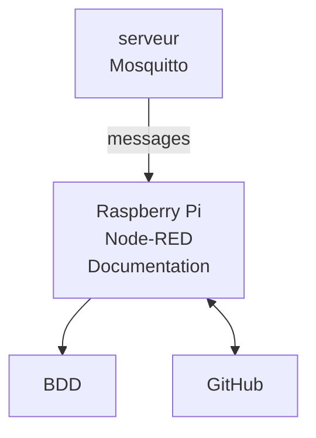

# test-univ-tours

Projet test pour montrer l'utilisation
Ce que le projet va permettre : 
- récupérer des messages
- les stocker en BDD
- les afficher
- utiliser Node-RED

```mermaid
flowchart TD
    mosquitto[serveur<br>Mosquitto] -->|messages| RPi[Raspberry Pi<br>Node-RED<br>Documentation]
    RPi --> BDD
    RPi <--> GitHub
```